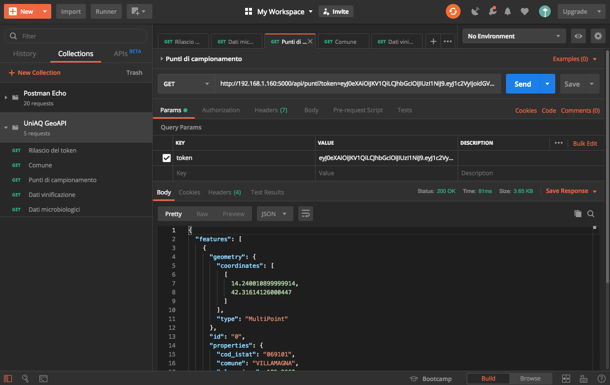

# UniAQ GeoAPI
API basata su Flask e sui principali pacchetti open source per la gestione di dati spaziali. Permette l'interrogazione di un database PostGIS popolato con dati geografici e dati agroambientali dell'Università degli Studi dell'Aquila.
Utilizza lo standard JSON Web Token (JWT) per l'autenticazione degli utenti attraverso un token temporizzato.

## End point delle API

### http://hostname/api/login
<ul>
    <li>PARAMETRI: <strong>username</strong>, <strong>password</strong></li>
    <li>RITORNA: JSON Object (token)</li>
    <li>ESEMPIO: http://hostname/api/login?username=your_username&password=your_password</li>
</ul>

### http://hostname/api/punti
<ul>
    <li>PARAMETRI: <strong>token</strong>,<strong>istatComune</strong></li>
    <li>VALORI AMMESSI: tutti i codici istat dei Comuni abruzzesi (es: 069101 per Villamagna)</li>
    <li>RITORNA: GeoJSON Feature Collection</li>
    <li>ESEMPIO: http://hostname/api/punti?token=eyJ0eXAiOiJKV1QiLCJhbGciOiJIUzI1NiJ9</li>
</ul>

### http://hostname/api/comuni
<ul>
    <li>PARAMETRI: <strong>token</strong>, <strong>istatComune</strong></li>
    <li>VALORI AMMESSI: tutti i codici istat dei Comuni abruzzesi (es: 069101 per Villamagna)</li>
    <li>RITORNA: GeoJSON Feature Collection</li>
    <li>ESEMPIO: http://hostname/api/comuni?token=eyJ0eXAiOiJKV1QiLCJhbGciOiJIUzI1NiJ9&istatComune=069101</li>
</ul>

### http://hostname/api/dati/microbiologici
<ul>
    <li>PARAMETRI: <strong>token</strong>, <strong>istatComune</strong>, <strong>tipoDati</strong></li>
    <li>VALORI AMMESSI: <i>biodiversita_funzionale</i>, <i>biodiversita_genetica</i></li>
    <li>RITORNA: JSON Object Array</li>
    <li>ESEMPIO: http://hostname/api/dati/microbiologici?token=eyJ0eXAiOiJKV1QiLCJhbGciOiJIUzI1NiJ9&tipoDati=biodiversita_funzionale</li>
</ul>

### http://hostname/api/dati/vinificazione
<ul>
    <li>PARAMETRI: <strong>token</strong>, <strong>istatComune</strong>, <strong>tipoDati</strong></li>
    <li>VALORI AMMESSI: <i>microvinificazione</i>, <i>maturazione_tecnologica</i></li>
    <li>RITORNA: JSON Object Array</li>
    <li>ESEMPIO: http://hostname/api/dati/vinificazione?token=eyJ0eXAiOiJKV1QiLCJhbGciOiJIUzI1NiJ9&tipoDati=microvinificazione</li>
</ul>

### http://hostname/api/raster/list
<ul>
    <li>PARAMETRI: <strong>istatComune</strong></li>
    <li>RITORNA: JSON Object</li>
    <li>ESEMPIO: http://hostname/api/raster/list?istatComune=069101</li>
</ul>

### http://hostname/api/raster/ndvi
<ul>
    <li>PARAMETRI: <strong>istatComune</strong>, <strong>anno</strong>, <strong>lotto</strong></li>
    <li>RITORNA: JSON Object</li>
    <li>ESEMPIO: http://hostname/api/raster/ndvi?istatComune=069101&anno=2018&lotto=07</li>
</ul>

### http://hostname/api/raster/dem
<ul>
    <li>PARAMETRI: <strong>istatComune</strong></li>
    <li>RITORNA: JSON Object</li>
</ul>

### http://hostname/api/raster/esposizione
<ul>
    <li>PARAMETRI: <strong>istatComune</strong></li>
    <li>RITORNA: JSON Object</li>
</ul>

### http://hostname/api/raster/pendenza
<ul>
    <li>PARAMETRI: <strong>istatComune</strong></li>
    <li>RITORNA: JSON Object</li>
</ul>

